## ERD CAMARIZE (MongoDB/Mongoose)

Diagrama de relacionamento entre entidades conforme os esquemas em `api/models`.

```mermaid
erDiagram
  User {
    string nome
    string email
    string senha
    string foto_perfil
    ObjectId fazenda  "ref Fazendas (opcional)"
    enum role         "membro|admin|master"
  }

  Fazendas {
    number codigo "auto-incrementado via hook"
    string nome
    string rua
    string bairro
    string cidade
    number numero
    string foto_sitio
  }        
  Cativeiros {
    number id_cativeiro
    string nome
    ObjectId id_tipo_camarao  "ref TiposCamaroes"
    date   data_instalacao
    buffer foto_cativeiro
    string temp_media_diaria
    string ph_medio_diario
    string amonia_media_diaria
    ObjectId condicoes_ideais "ref CondicoesIdeais (opcional)"
    ObjectId user             "ref User (opcional)"
  }

  TiposCamaroes {
    string nome
  }

  CondicoesIdeais {
    ObjectId id_tipo_camarao "ref TiposCamaroes"
    number temp_ideal
    number ph_ideal
    number amonia_ideal
  }

  Sensores {
    ObjectId id_tipo_sensor  "ref TiposSensor"
    string apelido
    buffer foto_sensor
    ObjectId user          "ref User (obrigatório)"
  }

  SensoresxCativeiros {
    ObjectId id_sensor    "ref Sensores"
    ObjectId id_cativeiro "ref Cativeiros"
  }

  Dietas {
    string descricao
    string horaAlimentacao
    number quantidade
  }

  DietasxCativeiros {
    ObjectId cativeiro      "ref Cativeiros"
    ObjectId dieta          "ref Dietas"
    date inicioVigencia
    date fimVigencia
    boolean ativo
    date criadoEm
    date atualizadoEm
  }

  ParametrosAtuais {
    date datahora
    number temp_atual
    number ph_atual
    number amonia_atual
    ObjectId id_cativeiro "ref Cativeiros"
  }

  TiposSensor {
    string descricao
    buffer foto_sensor
  }

  EspecifCamarao {
    ObjectId id_tipo_camarao "ref TiposCamaroes"
    ObjectId id_dieta        "ref Dietas"
    ObjectId id_condicao     "ref CondicoesIdeais"
  }

  FazendasxCativeiros {
    ObjectId fazenda   "ref Fazendas"
    ObjectId cativeiro "ref Cativeiros"
  }

  UsuariosxFazendas {
    ObjectId usuario  "ref User (modelo usa 'Users' na ref)"
    ObjectId fazenda  "ref Fazendas"
  }

  EmailSettings {
    ObjectId userId      "ref User (único)"
    boolean emailEnabled
    string  emailAddress
    string  template_language
    boolean template_includeCharts
    boolean template_includeActions
    boolean testEmailSent
    date    lastTestEmail
    string  quietHours_startTime
    string  quietHours_endTime
    number  frequency_maxEmailsPerHour
    number  frequency_maxEmailsPerDay
    number  frequency_minIntervalMinutes
  }

  PushSubscription {
    ObjectId userId  "ref User"
    string subscription_endpoint
    string subscription_keys_p256dh
    string subscription_keys_auth
    string deviceInfo_userAgent
    string deviceInfo_platform
    date   createdAt
    boolean isActive
  }

  Request {
    ObjectId requesterUser "ref User"
    enum requesterRole     "membro|admin"
    enum targetRole        "admin|master"
    string type            "leve|pesada"
    string action
    object payload
    enum status            "pendente|aprovado|recusado"
    ObjectId approverUser  "ref User (opcional)"
    ObjectId fazenda       "ref Fazendas (opcional)"
  }

  Conversation {
    ObjectId[] participants  "ref User"
    date lastMessageAt
    map  unreadCounts
  }

  Message {
    ObjectId conversationId  "ref Conversation"
    ObjectId senderId        "ref User"
    string text
    date   readAt
  }

  ConversationParticipants {
    ObjectId conversation  "ref Conversation"
    ObjectId user          "ref User"
    number   unread_count
  }

  %% Relacionamentos principais
  Fazendas ||--o{ User : "usuarios"
  User ||--o{ Sensores : "possui"
  User ||--|| EmailSettings : "1:1"
  User ||--o{ PushSubscription : "assina push"
  User ||--o{ Request : "solicitações (requester/approver)"

  Fazendas }o--o{ Cativeiros : "via FazendasxCativeiros"
  Fazendas }o--o{ UsuariosxFazendas : "usuários vinculados"

  Cativeiros }o--|| TiposCamaroes : "tipo de camarão"
  Cativeiros o|--|| CondicoesIdeais : "condições (opcional)"
  Cativeiros ||--o{ ParametrosAtuais : "leituras"
  Cativeiros }o--o{ Dietas : "via DietasxCativeiros"
  Cativeiros }o--o{ Sensores : "via SensoresxCativeiros"
  Cativeiros o|--o{ Fazendas : "via FazendasxCativeiros"
  Cativeiros o|--o{ User : "owner (opcional)"

  Sensores }o--o{ Cativeiros : "via SensoresxCativeiros"
  TiposSensor ||--o{ Sensores : "classifica"

  TiposCamaroes ||--o{ CondicoesIdeais : "define"
  TiposCamaroes ||--o{ Cativeiros : "classifica"

  Dietas ||--o{ EspecifCamarao : "associação"
  CondicoesIdeais ||--o{ EspecifCamarao : "associação"
  TiposCamaroes ||--o{ EspecifCamarao : "associação"

  Conversation ||--o{ Message : "mensagens"
  Conversation ||--o{ ConversationParticipants : "participantes"
  User ||--o{ ConversationParticipants : "participa"
  User ||--o{ Message : "sender"

  %% Tabelas de junção explícitas
  FazendasxCativeiros }o--|| Fazendas : "N:1"
  FazendasxCativeiros }o--|| Cativeiros : "N:1"
  UsuariosxFazendas }o--|| User : "N:1"
  UsuariosxFazendas }o--|| Fazendas : "N:1"
  DietasxCativeiros }o--|| Dietas : "N:1"
  DietasxCativeiros }o--|| Cativeiros : "N:1"
  SensoresxCativeiros }o--|| Sensores : "N:1"
  SensoresxCativeiros }o--|| Cativeiros : "N:1"
```



Observações:
- `ref` padronizado para `'User'`. `PushSubscription` foi ajustado no código. `UsuariosxFazendas` já deve referenciar `'User'` (verificar quando for usar este modelo).
 - `id_tipo_sensor` em `Sensores` agora referencia `TiposSensor` (ObjectId). Há conversão automática para catálogo quando enviado como string.
 - `Conversation.participants` e `Message.senderId` agora possuem `ref: 'User'` explícito no código e no diagrama.

### Papéis e Governança (membro, admin, master)

- `User.role`: enum `{ membro | admin | master }`.
  - **membro**: somente leitura no backend (bloqueio de escrita via middleware), pode criar `Request` para pedir ações.
  - **admin**: pode realizar ações administrativas na fazenda/recursos sob sua gestão; pode aprovar `Request` com `targetRole: admin`.
  - **master**: superusuário; pode aprovar `Request` com `targetRole: master` e exercer todas as ações.
- `Request` registra fluxo de aprovação:
  - `requesterUser` (User) com `requesterRole` ∈ {membro, admin}
  - `targetRole` ∈ {admin, master}
  - `approverUser` (User) que conclui a aprovação/recusa
  - `fazenda` (opcional) para escopo da solicitação

```mermaid
flowchart LR
  Membro[User.role = membro] -- cria --> Req[Request (type, action, payload)]
  Admin[User.role = admin] -- aprova/recusa --> Req
  Master[User.role = master] -- aprova/recusa --> Req

  Req -- targetRole: admin --> Admin
  Req -- targetRole: master --> Master

  subgraph Middleware
    BM[BlockMembersWrite]
  end

  Membro -- POST/PUT/PATCH/DELETE --> BM
  BM -- bloqueia escrita\n(exceto /requests) --> Membro

  subgraph Chat
    Conv[Conversation.participants]
    Msg[Message.senderId]
  end
  Admin -- participa --> Conv
  Master -- participa --> Conv
  Msg -- aponta --> Conv
```


